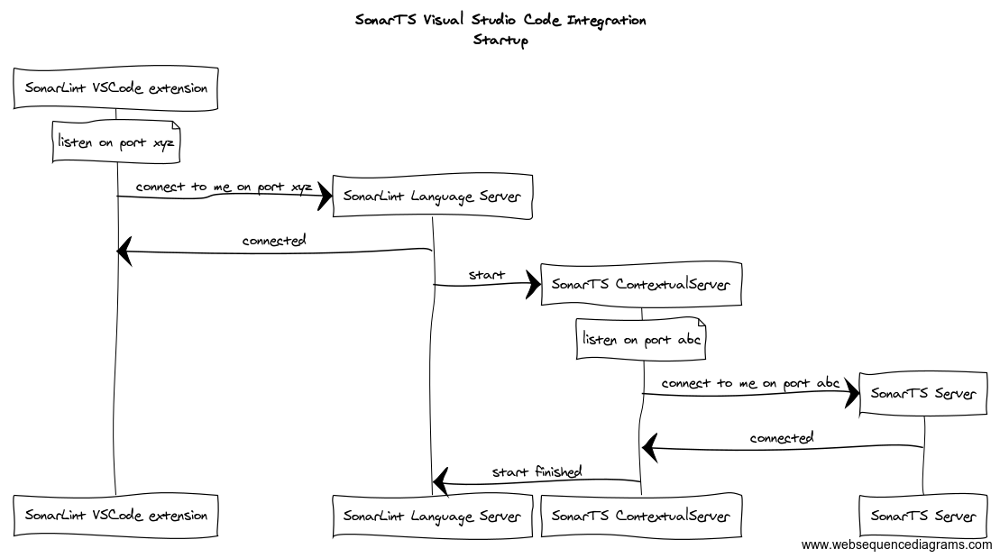
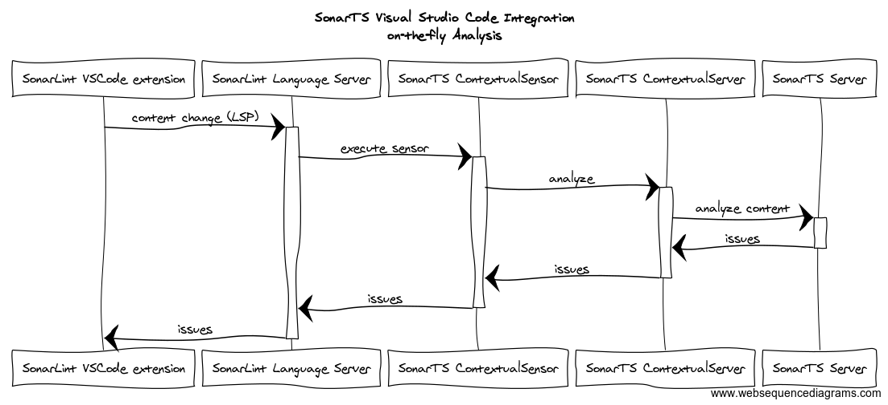

# SonarTS and SonarLint Visual Studio Code integration

[SonarLint for Visual Code](https://www.sonarlint.org/vscode/index.html) integrates SonarTS to provide on-the-fly 
analysis for TypeScript files. This document aims to explain mechanics of this integration.

## Startup

When VSCode activates SonarLint extension and requests analysis for the TypeScript file, first SonarLint Language Server 
is started. Communication between SonarLint extension and SonarLint Language Server is using 
[Language Server Protocol](https://microsoft.github.io/language-server-protocol/). SonarLint Language Server is written 
in Java and communication with SonarLint extension process is done with sockets on loopback interface.   

SonarLint Language Server then starts SonarTS Contextual Server, which in turn starts SonarTS Server. SonarTS Server is 
NodeJs process and communication is again done over sockets on loopback interface.  

## Analysis

VSCode will notify SonarLint extension for any changes in the editor, these changes will propagate to the SonarTS Server,
which will trigger the analysis on the current content of the project. Results of the analysis are then send back to
VSCode to present them to the user.

SonarTS Server uses TypeScript's compiler Language Service to provide fast incremental analysis of the project. This way
it is possible to have full type checker information and fast analysis.  
