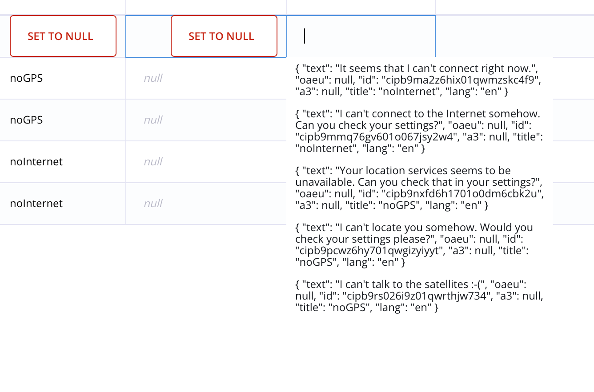
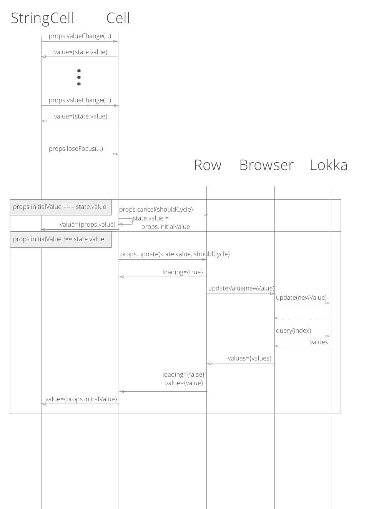

# Things to cover:
- shift from grid-based layout to row based layout.
- check out react-infinite. maybe there is some performance improvement over there.
- is it possible to fix misalignment problems because we can't influence when to reload
- is there a good schema to put Cells into modular components that work out-of-the-box (uncoupled from there parent environment)
- state management occurs on different levels to ensure that a proper way to do tabbing or "blurring".
- Implemented cells should manage blurring not, the cell wrapper (this should fix a lot of "hacky" stuff that we are doing currently)

## Quirky edge cases to consider
- when editing a relation popup, the value should be changed right when the user changes a value, the flow shouldn't enter a loading state or a editing state for a brief moment. This is open to discussion and I think for the sake of simplicity we should save values on a button click.
- Tabbing in add row should be cycle through the add row while in normal rows it should go to next row
- When tabbing in the last row, it should continue in the first row again
- When tabbing into row that you can't see, we need to scroll to that field.
- Because scrollListeners are expensive it might not be the best idea to use a scroll listener to achieve horizontal scrolling for the fixed header. maybe we should use `requestAnimationFrame` (Ask Tim or Google. I have no idea what it is.)
- The alignment bug occurs because react-virtualized is not forced to rerender everything. Maybe a custom way to change the width of the field could be the solution.
- There should be a simple and easy way to incorporate nullable cells. Currently, we replicate the child element and remove the blurring function. A problem arises when we want to create presses 'Tab' which also runs through the focus method. Then something like in this image below happens.

## Things we have learned by transitioning from Row-based layout to Grid-based layout:
We did it to first adapt our architecture to React-virtualized which would only render the visible grids. The problem is that it didn't work out, since otherwise the horizontal scrolling is very laggy.
Therefore the current version doesn't support just-in-time rendering for horizontal scrolling but only for vertical scrolling.

This flow describes what will happen after the user updates or cancels the input. The Cell component is to store the initial value if the user cancels his input. It is also responsible to render the loading screen while a value is fetched or updated.

The value of an item shouldn't be handled by the Cell because this would prevent special value types to display the values in their own way. Instead the values will be presented at ReadCell that default to a div rendering a string but in case of future needs to change this, we can just swap out the ReadCell with a specific ReadCell that is suited for the data type.

Whether a field should update or not should never be determined by the Cell component but only in the SpecificCell. This is to prevent issues that we have used a lot of conditional code to cover up in the current version because sometimes we can't accurately recreate the "blur" event because of the way an element is positioned etc.

Since we won't be working with disabled input fields rercreate the focus next functionality when tabbing, we can just display an arbitrary div or span to show the readonly information. Whether or not a field is focused is only depending on the edit property of the Cell and the Specific cell. The edit property is cascaded down from the Cell to the SpecificCell.

The row also has a focused field that determines whether or not the row should be in focus. This is used for tab cycling. In also defines a onLastCellBlur method that can vary depending on if the row is a standard row or an "add" row.

Standard Row would just change the current rows focus to false and reset the nextFocus field to 0. Then the next row will be focused and implicitly the Cell as well.
In "add" row this behavior is different. When the user presses tab while editing the last Cell, it will just jump back to the first Cell. This couldn't be achieved with standard tabindexes because they don't support a way of cycling through fields.

## Row Architectures:
### Features:
- misalignment shouldn't be an issue anymore
- same archtiecture for new and normal editing row (make use of higher order components to create similar rows without too much unstructured and conditional code)
- (smooth) infinite scrolling support (virtualscroll from react-virtualized?)
- easy design that we only have to iterate over the edges and then map them with existing or default field values

## Cell Architectures:
### Features:
- correct visualization independent from their environment
- onfocus changes the cell into an edit cell
- correct tabindexing
- support for multiple states:
  - add state:
    - enter => adds new node
    - shift + enter => new line
  - edit state:
    - enter => new line
    - shift + enter => add (still needs to be discussed)
  - similar in both states:
    - escape = > returns to previous value
